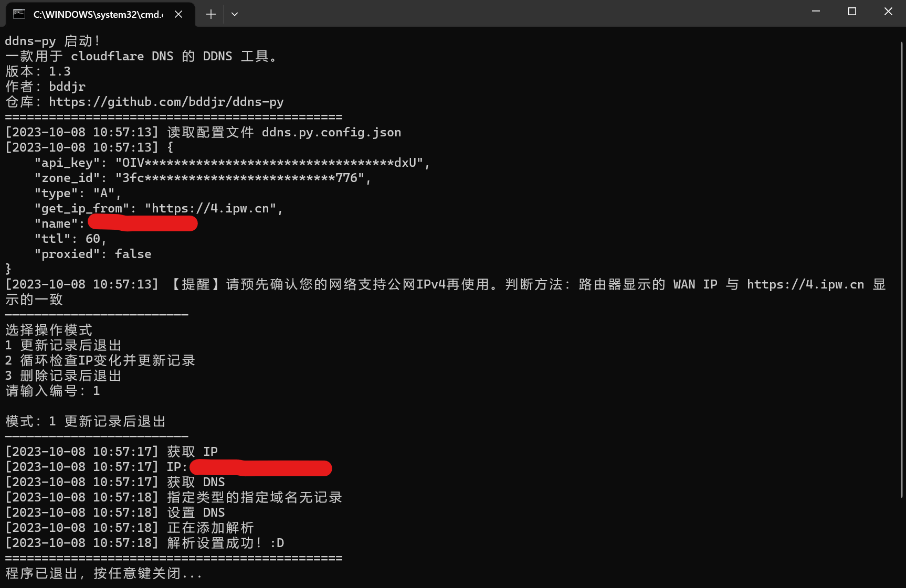

# ddns-py
一款用于 cloudflare DNS 的 DDNS 工具。

  

***
## 配置

### ip
如果使用IPv4（A），请确认您的网络支持公网IPv4。
```
    "type": "A",
    "get_ip_from": "https://4.ipw.cn",
```

如果使用IPv6（AAAA），请确认您的网络支持公网IPv6。家庭宽带可能需要将光猫、路由器的防火墙关闭（会暴露所有IPv6端口！）
```
    "type": "AAAA",
    "get_ip_from": "https://6.ipw.cn",
```

### api_key
在 <https://dash.cloudflare.com/profile/api-tokens> 上方的 “API令牌” 里点击 “创建令牌” ，然后找到 “编辑区域DNS” 并点击右边的 “使用模板” ，后面的步骤你自己来。

### zone_id
在您想要DDNS的域名的根域管理页面复制 “区域ID” 。

### name
填写您想要DDNS的域名。

### ttl
填写DNS缓存时间（单位：秒）。

### proxied
开启 proxied 仅用于为网页服务器套 cloudflare CDN 作为防护，其它多数服务不适用，还可能会减速，请慎重开启

***
## 启动方法
### Windows
预先安装python3  
然后双击 `ddns.py.bat` 启动，或者在命令行输入 `py ddns.py`  

### Ubuntu
```
apt install python3 python3-pip
python3 ./ddns.py
```

***
## 命令行参数
### 使用命令行参数跳过询问模式
在命令后面按照如下格式加上参数  
```
mode=2
```
其中 `=` 后面是模式编号，请参照下方列出的编号进行修改，不得在等号两侧添加空格。  
```
1 更新记录后退出
2 循环检查IP变化并更新记录
3 删除记录后退出
```

### 使用命令行参数指定配置文件读取路径
在命令后面按照如下格式加上参数  
```
configfile=ddns.py.config.json
```
其中 `=` 后面是配置文件所在的相对路径或绝对路径，相对路径参照`ddns.py`所在文件夹，而非命令行所在文件夹。  
不得在等号两侧添加空格。  
